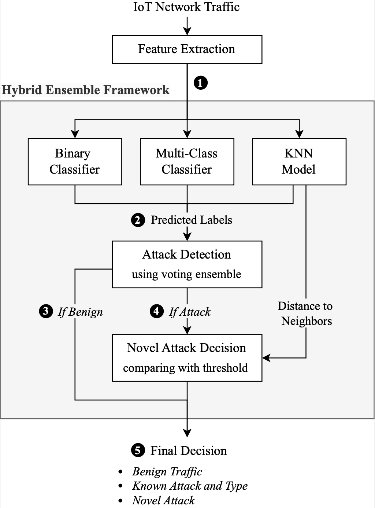

## Portfolio of Projects

---

### [A Hybrid Ensemble Framework for Intrusion Detection in IoT Networks](https://github.com/JoshuaWang8/novel-attack-nids)

Developed a machine learning model capable of identifying cyberattacks on Internet of Things (IoT) networks whilst also differentiating between benign, known attack and novel attack traffic types.

This project was completed for my thesis, and the manuscript has been submitted for publication as of 5 March 2025.

🛠 **Technologies Used**: Python, PyTorch, Pandas, Numpy, Scikit-learn, Matplotlib

📄 [View Thesis Report (PDF)](/pdf/Novel_Attack_Detection_in_IoT_Network_Intrusion_Detection_Systems.pdf)
\
📄 [View Seminar Slide deck](/pdf/Novel_Attack_Detection_Seminar_Slides.pdf)
\
🔗 [View GitHub Repository](https://github.com/JoshuaWang8/novel-attack-nids)

  

---

### [Link Prediction in Graph Networks](/pages/link_prediction/link_prediction.md)

Explored various link prediction methodologies to a graph dataset to predict future linkages between users. Approaches implemented include the Katz Index, Jaccard similarity, Adamic-Adar index, Graph Convolutional Network, neural network binary classifier and a comparison of graph embedding distances.

🛠 **Technologies Used**: Python, PyTorch, Scikit-learn, Numpy, Pandas, NetworkX

🔗 [View GitHub Repository](https://github.com/JoshuaWang8/link-prediction)

 

---

### [Analysis of Facebook Political Ad Data](https://github.com/JoshuaWang8/political-ads-analysis)

Analyzed Facebook ad strategies used by politicians in the 2022 Australian Federal Election, focusing on spending patterns and demographic targeting to assess election success impact.

🛠 **Technologies Used**: PySpark, Python, Pandas, Matplotlib

📄 [View Project Details](/pdf/Political_Ad_Analysis.pdf)
\
🔗 [View GitHub Repository](https://github.com/JoshuaWang8/political-ads-analysis)

 

---

### [Centrality Measures in Graph Networks](/pages/centrality_measures/centrality_measures.md)

Implemented Betweenness Centrality and PageRank Centrality to identify influential nodes in a Facebook social network dataset.

🛠 **Technologies Used**: Python, NetworkX, Numpy, Matplotlib

🔗 [View GitHub Repository](https://github.com/JoshuaWang8/centrality-measures)

---

### [apha.ai: Support for Aphasia Patients](https://github.com/JoshuaWang8/apha-ai)

Led a team of six to develop **apha.ai**, a web application assisting patients with aphasia in understanding and interacting with text content. The tool leverages AI-driven large language models to enhance communication accessibility.

🛠 **Technologies Used**: React.js, Javascript, Python, TensorFlow, PyTorch

🔗 [View GitHub Repository](https://github.com/JoshuaWang8/apha-ai)

  

---

### [Food Type Classification using Machine Learning](/pdf/Food-Classification-Report.pdf)

Implemented k-Nearest Neighbors, Logistic Regression, and Neural Networks to classify foods as solids or liquids based on nutrient data. Included PCA, k-fold Cross Validation, and hyperparameter tuning, achieving an F1 score of 93.3%.

🛠 **Technologies Used**: Python, Pandas, Numpy, Scikit-learn, Matplotlib

📄 [View Report (PDF)](/pdf/Food-Classification-Report.pdf)

 

---

### [Alzheimer's Disease Classification with Vision Transformer](https://github.com/JoshuaWang8/PatternFlow/tree/topic-recognition/recognition/46965611-ADNI-Brain-Visual-Transformer)

Developed a Vision Transformer model with Shifted Patch Tokenization and Local Self-Attention to classify Alzheimer’s Disease from MRI brain scans.

🛠 **Technologies Used**: TensorFlow, Python, Matplotlib

🔗 [View GitHub Repository](https://github.com/JoshuaWang8/PatternFlow/tree/topic-recognition/recognition/46965611-ADNI-Brain-Visual-Transformer)

---
