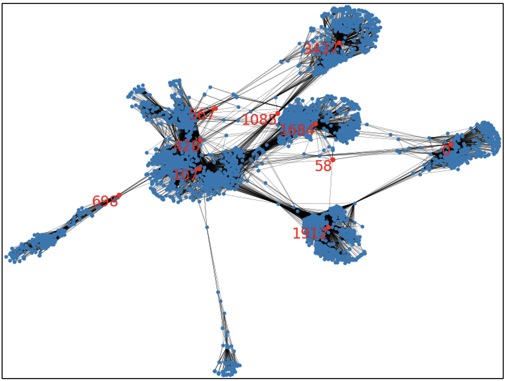
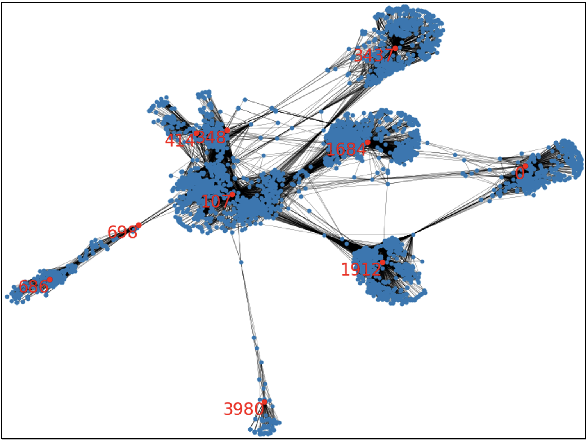

# Implementing Centrality Measures to Identify Influential Nodes in a Graph

## **Project Description**
Node centrality measures are methods for finding who the most important and influential individuals in a network are. In this project, two algorithms will be implemented to compute node centrality, and this report will detail the steps taken to perform the calculations and the results of the algorithms. The data this project will use will be publicly available anonymized Facebook social network data, which contains 4039 nodes and 88234 edges in total. Using this dataset, the two node centrality measures that will be calculated will be the Betweenness and PageRank Centrality measures.

## **Project Code and Dependencies**
The implementation for this project can be found at [https://github.com/JoshuaWang8/centrality-measures](https://github.com/JoshuaWang8/centrality-measures). All code in the project uses Python (version 3.8.18). Additionally, the following libraries are required:

- NetworkX (version 3.1)
- Numpy (version 1.24.3)

To run the code for this project, navigate into the folder containing the file ‘main.py’ in the terminal. Next, ensure that the correct file path is inputted for loading the Facebook network data – this can be done by changing the text file to load in line 131 of 'main.py'. Finally, run the code file by inputting ‘python3 main.py’ into the terminal. This will create the 'full_results.csv’ and 'top_results.txt’ files, which provide details of which nodes within the graph are significant.

## **Methodology**
Before performing the calculations for the Betweenness and PageRank centralities, the Facebook network data was first used to create a NetworkX graph object to simplify the manipulation of the dataset. Since the network data is stored in a text file with pairs of connected nodes, this was achieved by adding each of the edges into a NetworkX graph object.

### Betweenness Centrality:
The Betweenness centrality is a path-based measure of centrality which measures how important a node is in connecting other nodes. It is calculated by the proportion of shortest paths between all pairs of nodes that will pass through a certain node, which is formulated as:

$$
C_b(v_i) = \sum_{s \neq t \neq v_i}{\frac{\sigma_{st}(v_i)}{\sigma_{st}}}
$$

where $\sigma_{st}$ is the number of shortest paths from vertex $s$ to $t$ (information pathways) and $\sigma_{st}(v_i)$ is the number of shortest paths from $s$ to $t$ that pass through $v_i$.

The trivial solution for calculating the Betweenness centrality is by using Dijkstra’s algorithm to count the number of shortest paths that pass through each node, and performing this for all nodes in the network. However, this would result in a complexity of O($n^3$), which is extremely inefficient, especially for this project given the large number of nodes.

Instead, this project uses the Brandes Algorithm for finding the Betweenness centrality, which is done in two phases for all nodes. The Brandes Algorithm states that

$$
C_b(v_i) = \sum_{s \neq t \neq v_i}{\frac{\sigma_{st}(v_i)}{\sigma_{st}}} = \sum_{s \neq v_i}{\delta_s(v_i)}
$$

where:

$$
\delta_s(v_i) = \sum_{t \neq v_i}{\frac{\sigma_{st}(v_i)}{\sigma_{st}}}
$$

And to find $\delta_s(v_i)$, we can use the equation:

$$
\delta_s(v_i) = \sum_{w:v_i\in pred(s,w)}{\frac{\sigma_{sv_i}}{\sigma_{sw}}(1+\delta_s(w))}
$$

In the first phase of the algorithm, breadth-first search is performed starting from a certain node $s$ to find the shortest paths and number of shortest paths from $s$ to all other nodes. The second phase then accumulates the dependencies of each node to calculate the Betweenness centrality. By repeating the two phases for all nodes in the network, the Brandes Algorithm can calculate the Betweenness centralities for all nodes much more efficiently than the trivial solution.

Applying the Brandes Algorithm to the Facebook network, the algorithm will calculate a Betweenness centrality value for each node. The greater the value is for a given node, the more important that node is, as a greater number of shortest paths will pass through that node. The top 10 nodes which were found with the greatest Betweenness centralities can be found in the table below. These nodes are also highlighted in the image of the network below in red.

|  Node  |  Betweenness Centrality  |
|:------:|:------------------------:|
|  107   |  7833120.28              |
|  1684  |  5506573.37              |
|  3437  |  3849012.30              |
|  1912  |  3737836.42              |
|  1085  |  2429155.51              |
|  0     |  2384992.22              |
|  698   |  1880048.49              |
|  567   |  1569993.81              |
|  58    |  1375189.96              |
|  428   |  1048328.13              |

  

From the above results, we can observe that the most important nodes identified by betweenness centrality were those that had many connections with other nodes and were at the center of the larger clusters within the network. This is expected, since nodes which are at the center of large clusters will usually also be traversed through in many of the shortest paths from any one node to another. For the nodes that had a high betweenness centrality but are not in the center of a cluster (such as 1085, 698 and 58), we can see that they connect other large clusters together. Since betweenness centrality measures the importance of a node in connecting other nodes, this result is also expected.

### PageRank Centrality
PageRank centrality is a measure of the importance of a node based on the other nodes that are connected to it, making it a type of spectral centrality measure. The importance of a node is dependent on whether it is connected to central nodes, where nodes that are connected to nodes with a larger centrality score is more important than those connected to non-central nodes. Thus, when a node’s neighbours have a high PageRank centrality, then the node itself can expect to also have a higher PageRank centrality.

The formula for PageRank centrality is:

$$
C_p(v_i)=\alpha \sum_{j=1}^{n}{A_{j,i}\frac{C_p(v_j)}{d_j^{out}}}+\beta
$$

where:
- $A_{j,i}$ is the element of the adjacency matrix showing whether there is an edge from node $v_j$ to node $v_i$
- $C_p(v_j)$ is the PageRank score of node $v_j$
- $d_j^{out}$ is the out-degree of node $v_j$
- $\alpha$ and $\beta$ are parameters for the probability of jumping to a random node and constant bias, respectively

To compute the PageRank centrality for all nodes, the power iteration method can be used. Firstly, if $d_j^{out}>0$, then the formula can be rearranged to become:

$$
C_p=\alpha A^T D^{-1} C_p + \beta 1 = \beta(I - \alpha A^T D^{-1})^{-1} \bullet 1
$$

where $D$ is the degree matrix $diag(d^{out}_1, d^{out}_2, ..., d^{out}_n)$. Then, whilst the difference between the current iteration of $C_p$ and the previous iteration of $C_p$ is greater than some predetermined threshold, we repeatedly calculate:

$$
C_p^{current} = \alpha A^T D^{-1} C_p^{prev} + \beta1
$$

until $C_p$ converges (the difference between consecutive iterations is lower than the threshold). The resulting $C_p$ is then a vector the same length as the number of nodes, with each element being the PageRank value for that specific node.

By applying the PageRank centrality to the Facebook network dataset, we can find the top 10 nodes with the greatest PageRank centrality scores. These are shown in the table below and are highlighted in the image of the graph below.

| Node |   PageRank Centrality  |
|:----:|:----------------------:|
|  107 |  0.0002702669599437189 |
| 3437 |  0.0002700656343969577 |
|   0  |  0.0002682249108414422 |
| 1684 |  0.0002663169146467671 |
| 1912 | 0.00025976387925228734 |
|  348 | 0.00025450759329431906 |
|  414 |  0.0002538768535808786 |
| 3980 |  0.0002537729091377861 |
|  686 |  0.0002534633764257173 |
|  698 |  0.000251187026522806  |

  

From the above results, we can observe that the most influential nodes according to PageRank centrality are those that are in the centers of clusters. Since nodes are considered to be more important when they are connected to central nodes under PageRank centrality, this result and the top 10 nodes that were identified is expected.

## **Summary**
This project aimed to compute node centrality measures for a Facebook social network dataset containing 4039 nodes and 88324 edges. Two centrality measures, Betweenness and PageRank centrality, were implemented and applied to the network data.

The top 10 nodes with the highest centrality scores for both Betweenness and PageRank centrality were identified and highlighted in the network graph. This was performed by using the Brandes Algorithm to efficiently compute the importance of nodes in connecting other nodes based on the number of shortest paths for Betweenness centrality, and by using the power iteration method to iteratively update centrality scores based on the importance of nodes connected to each other for PageRank centrality.

The analysis of the results from the two centrality algorithms revealed that nodes with high Betweenness centrality were those that connected multiple clusters, whilst nodes with high PageRank centrality were the ones that were central within clusters. This means that for Betweenness centrality, the nodes that serve as a “bridge” and facilitate communication between different parts of the network are more important. Meanwhile, under PageRank centrality, the nodes that influence other nodes in the same cluster are more important. 

---

[Back to Portfolio](/index.md)